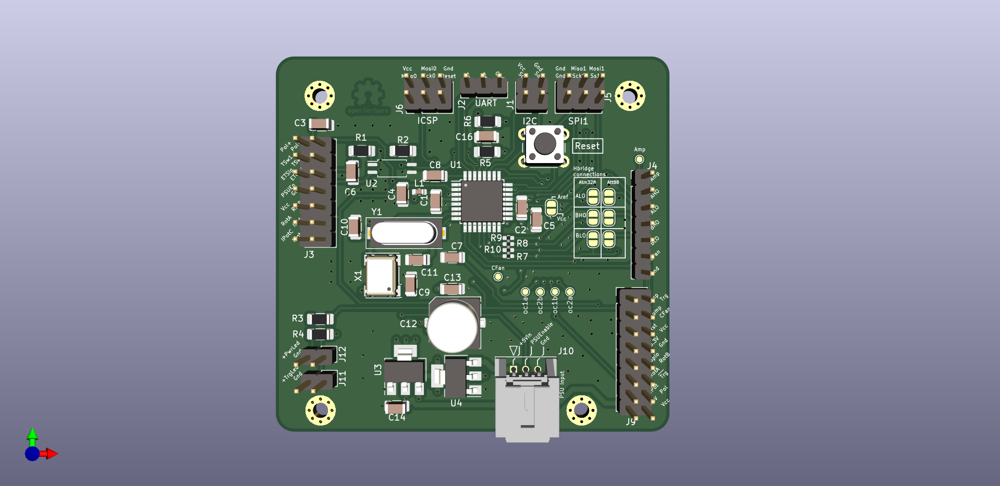
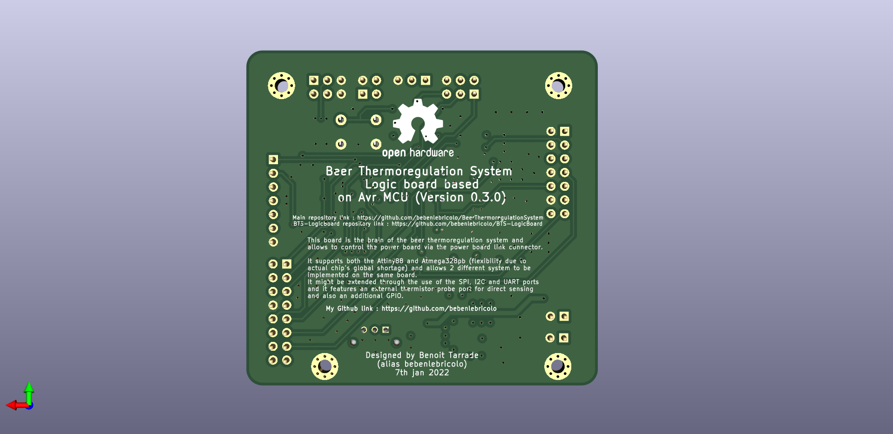

# Index
- [BTS-LogicBoard](#bts-logicboard)
- [Features](#features)

# BTS-LogicBoard
Beer thermoregulation system logic board.
This board is meant to provide a PWM control signal to the [BTS-MainBoard-Control](https://github.com/bebenlebricolo/BTS-MainBoard-Control) board and will be driven by different input sources :
  1. External input mechanisms, implying and external trigger signal and a mechanical user interface such as switches and potentiometers.
  2. Temperature sensor(s) using thermistor based sensors

## 1. External triggering signal specificities
The later option was the first the be developped as it allowed to use an external regulation device as the triggering signal source (using a different power supply).
The input triggering signal is either *ON* or *OFF*.
As a consequence, we also need to get the "polarity" information, tells the system to warm up or cool down the thermal fluid.

## 2. Automatic temperature regulation using temperature sensors
This option

This board is envisioned as a starting point as it only embeds generic electronic devices, meaning no code at all.
I've done this on purpose, to keep things relatively simple and eliminating the need to iterate over software revisions, bug fixes, etc.
As the functionalities implemented by this board are relatively simple, I thought it would be a nice alternative to go only with a NE555 (the famous one) and few other electronic components such as comparators and logic gates to perform the basic functions.

# Features
This boards boats the following features :
* 1 MHz (or so) PWM signal with linear (...or so) duty cycle control
* Cooling fan automatic turn on when board is enabled and turn off after a precalculated delay (around 120s) when the board is disabled
* Externaly driven : the PWM signal only starts up when an input signal is applied on the enable pins. This is meant to receive a pump driver signal in order to start up
* Mechanical interface (switches and potentiometer) with status leds
  * Power on status LED
  * PWM enabled status LED
  * PWM intensity status LED